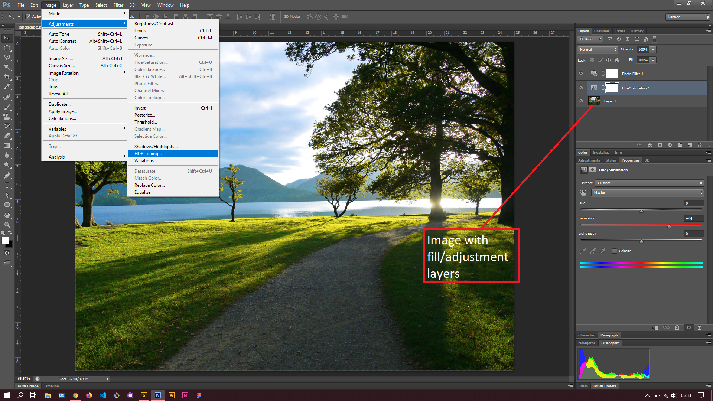
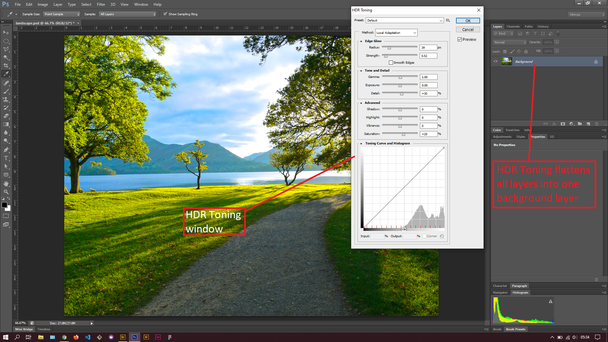

## About Lesson 54

### Brief
In this lesson, I learnt about HDR tonning image adjustment. This tool lets you apply the full range of HDR(High Dynamic Range) contrast and exposure settings to images. It can be accessed via the menu `Image > Adjustments > HDR Toning`.

### Illustrations

In this illustration, I opened an image with a blue photo filter and a adjustment layer that increased the saturation of the image.

I then opened the HDR Toning window as illustrated and adjusted a few of the settings. The HDR toning tool flattens all the layers into one image which would house the end result of the tone mapping.

### Online Course
Visit [IACT](https://iact.ie) for the course