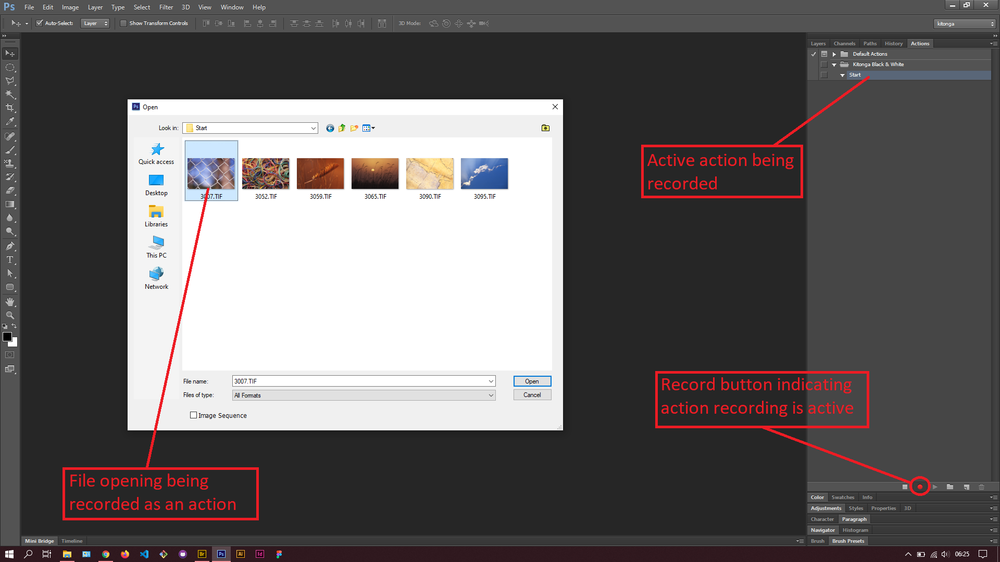

## About Lesson 56

### Brief
In this lesson, I learnt about photoshop actions which are pre-recorded set of actions that make it easier to redo certain actions performed. These actions may include applying filters, clip masks, gradients e.t.c.

### Illustrations

In this illustration, I first created a set via the dropdown menu located on the top right of the Actions palette. I then proceeded to create an action under the custom set created. At this point photoshop had begun recorded actions performed.

I then opened an image that would house the action results to be performed later on to the rest of the images in the same folder.

Here, I applied an black and white image adjustment to the opened image. I then saved the image in a folder that will house the end results and closed it. All these actions were being recorded for use under the Actions palette.

I opened the Batch processing window via the menu `File > Automate > Batch`. Here, I could specify the set of actions to be applied, the source folder and destination folder.

Below is the end result of the batch processing where all images have been applied a black and white image adjustment.

### Online Course
Visit [IACT](https://iact.ie) for the course