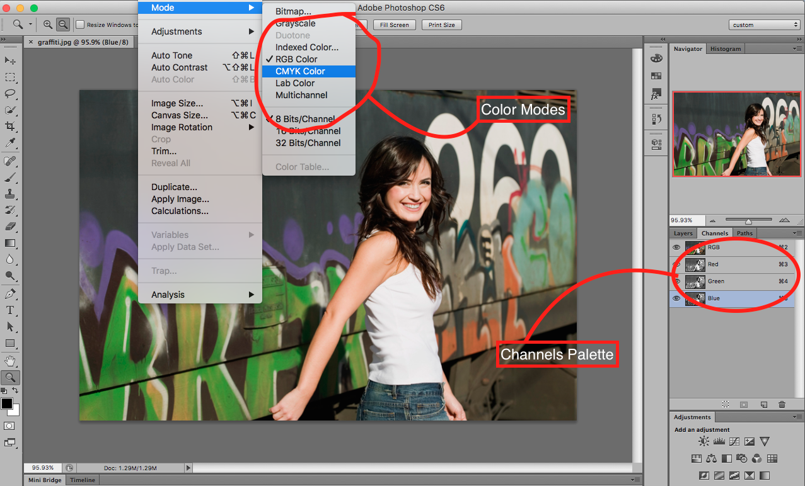

## About Lesson 3

### Brief
In this lesson, I learnt about the various color modes under ```Image > Modes``` menu where the RGB and CMYK modes reside. When each color mode is toggled, the Channels palette changes to accommodate colors for the selected mode. The main color modes that we would work with are:

- RGB(Red, Green and Blue) mode(default), mostly used for screen based graphics.
- CMYK(Cyan, Magenta, Yellow and Black) mode, mostly for print based graphics.

### Illustration


### Online Course
Visit [IACT](https://iact.ie) for the course
