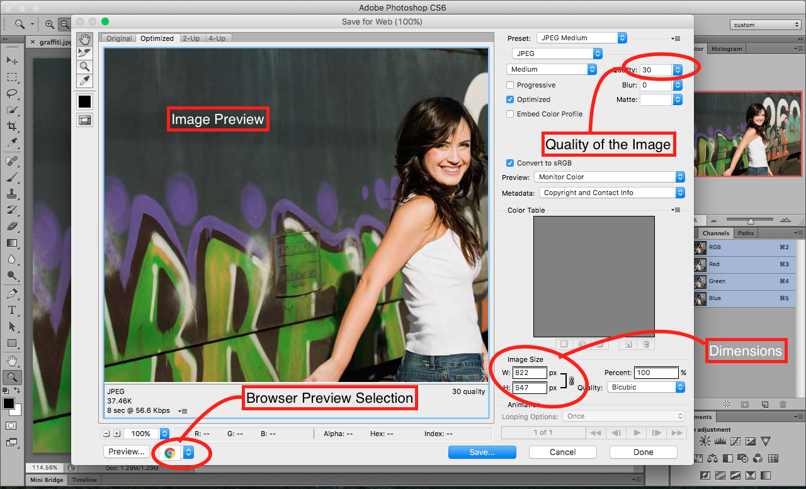
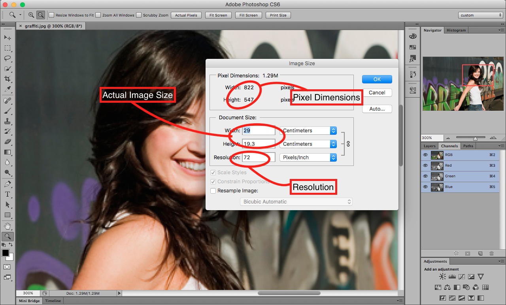

## About Lesson 7

### Brief
In this lesson, I learnt about manipulating the image size and resolution for screen based and print based image editing. Some of the things to consider are:

- Document Size(Image size) which are the actual dimensions of the image measured as cm/inches in width x height.
- Pixel dimensions which are measure as actual pixels in width x height.
- Resolution which is measured as actual pixels per inch of the image.

### Illustration for Screen Based resolution


Accessed under the menus: ```File > Save for Web and Devices```

### Illustration for Print Based resolution


Accessed under the menus: ```Image > Image Size```

### Online Course
Visit [IACT](https://iact.ie) for the course
